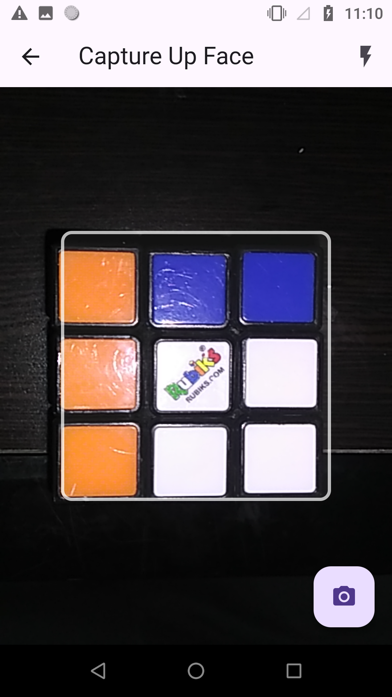
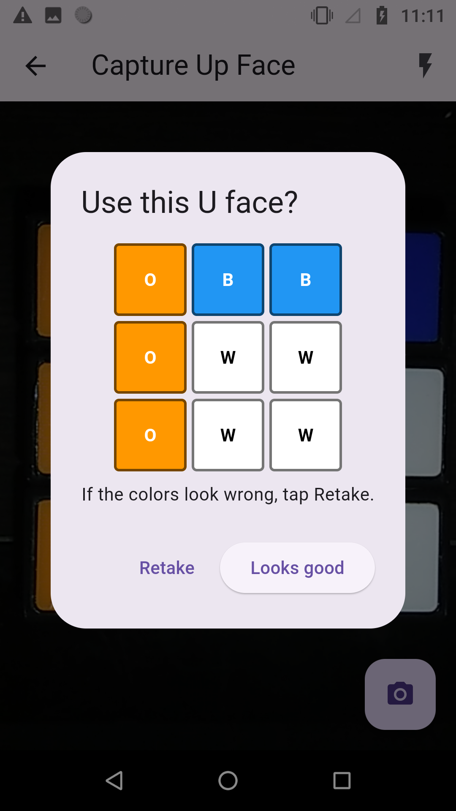
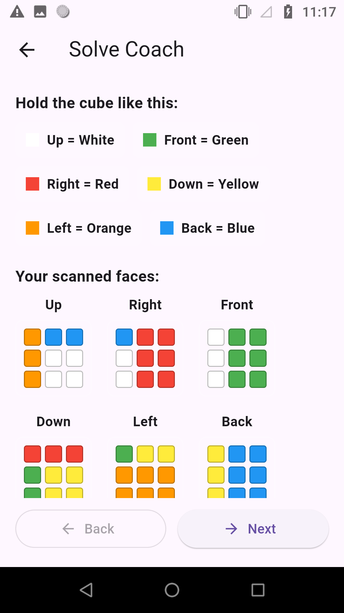
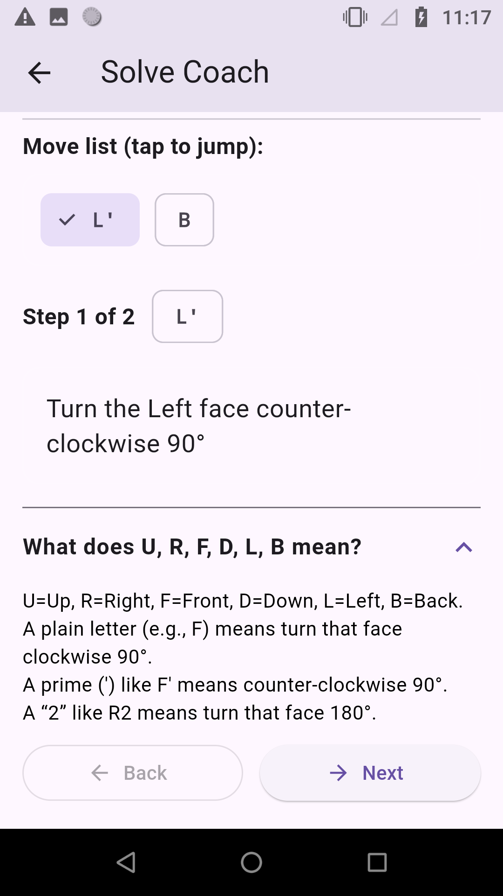

# Rubik's Cube Solver

A full-stack mobile app that scans a real Rubik’s Cube, detects its colors face by face using computer vision, and then walks the user through solving it step-by-step.

https://github.com/ntoptchi/rubiks_cube_solver

---

## Overview

This project combines **Flutter** (for the mobile front-end) and **FastAPI + OpenCV** (for backend image processing and cube solving).  
Users capture each face of a real cube using their phone camera. The backend extracts color grids, reconstructs the cube state, and computes the optimal solve sequence using the **Kociemba algorithm**.

The app then guides the user through solving the cube interactively, move by move.

---

## Features

### Computer Vision
- Detects cube faces from phone camera images
- Classifies each square color using HSV and LAB color spaces
- Auto-white-balancing and CLAHE lighting correction
- Works under various lighting conditions (torch optional)

### Backend (FastAPI)
- `/scan_face` — detects a 3×3 color grid from one face photo
- `/solve_from_grids` — combines 6 scanned faces and returns:
  - The full solution moves (e.g., `["F", "R'", "U2"]`)
  - Generated cube textures for visualization
  - Rotation metadata for internal consistency
- Implements Kociemba 2-phase algorithm via Python wrapper

### Frontend (Flutter)
- Full camera interface with live preview & face guide overlay  
- Optional torch toggle for low-light capture  
- After each scan, users can review and confirm the 3×3 grid before continuing  
- Displays the **Solve Coach** screen:
  - Clear, human-readable move explanations  
  - Visual preview of scanned faces  
  - Step-by-step “Next” and “Back” buttons

---

## Screenshots

| Scan Cube |
|  |
| Review Grid |
|  |
| Solve Coach |
| | 
| |


---

## Tech Stack

| Component | Technology |
|------------|-------------|
| **Frontend** | Flutter (Dart), Camera plugin |
| **Backend** | FastAPI (Python 3.10+), OpenCV, NumPy |
| **Solver** | Kociemba algorithm |
| **Image Handling** | CLAHE, HSV & LAB color detection |
| **Communication** | REST via HTTP (JSON, multipart form-data) |

---

## Setup Instructions

### Backend Setup

#### Requirements
```bash
python -m venv venv
source venv/bin/activate  # (Windows: venv\Scripts\activate)
pip install -r requirements.txt
```

#### Run FastAPI server
```bash
uvicorn main:app --reload
```

Server runs at:  
`http://127.0.0.1:8000`

Test endpoints at:  
`http://127.0.0.1:8000/docs`

---

### Mobile Setup (Flutter)

#### Requirements
- Flutter SDK 3.0+
- Android Studio or VS Code setup for Android/iOS

#### Install dependencies
```bash
flutter pub get
```

#### Connect to backend
Edit `/lib/services/api.dart`:
```dart
const baseUrl = 'http://127.0.0.1:8000/api';  // or your LAN IP
```

If testing on a physical Android device:
```bash
adb reverse tcp:8000 tcp:8000
```

#### Run app
```bash
flutter run
```

---

## Architecture

```
mobile_app/
├── lib/
│   ├── pages/
│   │   ├── camera_page.dart        # capture + face guide overlay
│   │   ├── solve_coach.dart        # solution walkthrough
│   │   └── input_page.dart         # entry / routing
│   ├── services/api.dart           # backend communication
│   └── main.dart                   # app entry point
backend/
├── main.py                         # FastAPI entry
├── scan.py                         # /scan_face endpoint
├── solver/kociemba_solver.py       # cube solver logic
└── utils/generate_textures.py      # face texture rendering
```

---

## Troubleshooting

| Issue | Fix |
|-------|-----|
| **“Connection refused”** | Ensure `uvicorn` server is running and port reversed if on device |
| **“auto-rotation failed”** | Re-scan with each face flat and well-lit |
| **Blue/Orange misread** | Adjust lighting; avoid direct reflections; use natural light |

---

## Author

**Nicholas Toptchi**  
University of South Florida  
📧 [ntoptchi@usf.edu]  
💻 [LinkedIn](https://linkedin.com/in/nicholas-toptchi) · [GitHub](https://github.com/ntoptchi)

---

### ⭐ If you found this useful, consider starring the repo!


